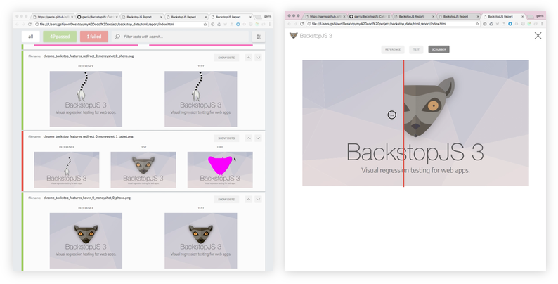

# JvM Visual Regression Tester

Automates visual regression testing of our projects by comparing DOM screenshots over time.<br/>
Convinience wrapper around [`BackstopJS`](https://garris.github.io/BackstopJS/).



## Getting started

### Install

```bash
npm i @jungvonmatt/visual-test
```

## Usage

**Initialize project**

```
visual-test reference
```

**Run tests**

```
visual-test test
```

**Approve tests**

```
visual-test approve
```

You can optionally add query parameters to the requests with the `--query` argument

```
visual-test test --query 'optimize-css=1&debug=true'
```

You can specify a custom config directory using the `--config-dir` option

```
visual-test test --config-dir ~/.my-visualtest-directory
```

Or just call with the url to the sitemap

```
visual-test test https://www.jvm.com/sitemap.xml
```

## Add projects

To add a projects you need to place a config file in one of the following locations:

- In a custom path specified by `--config-dir`
- In the current working directory

Name: `project`.visualtest.config.js

**Example:**

```
module.exports = {
  environments: [
    {
      name: 'LOCAL',
      host: 'http://jvm.localenv:1313,
    },
    {
      name: 'PROD',
      host: 'https://www.jvm.com',
    },
  ],
  urls: [
    '/',
  ]
}
```

You can also use an async function instead of the static array. The `urls` function receives the chosen environment as first parameter so you might grab the sitemap.xml to generate the urls dynamically.
